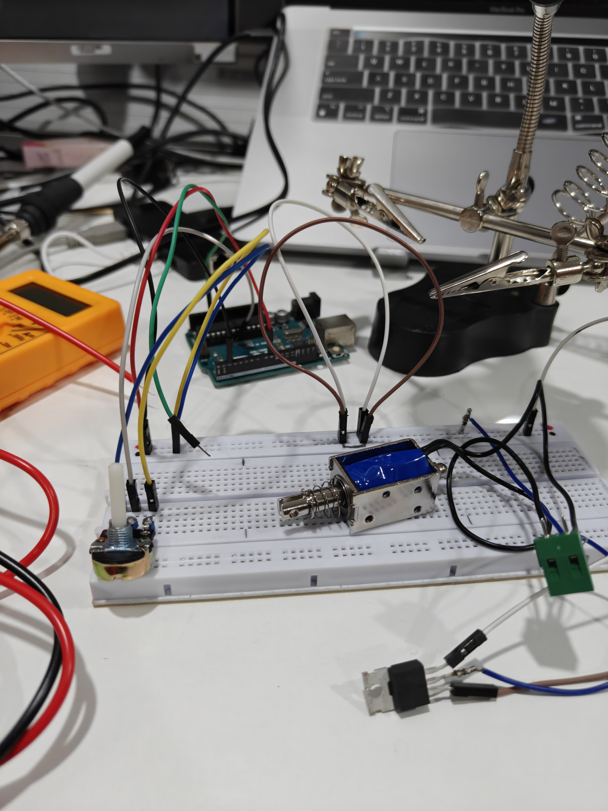

# ⚡ AEGIS — Dual-Layer EV Charging Security System
> **MAHE Mobility Challenge 2026 · Track B: Secure Plug & Charge Protocol**

AEGIS is a hardware-software intervention designed to protect EV infrastructure from two critical attack vectors: **Juice Jacking** (PWM signal injection) and **Identity Spoofing** (Rogue chargers).

By implementing a **"Fail-Fast"** architecture, AEGIS ensures that no cryptographic data is ever exposed to a source that hasn't first passed a physical signal integrity check.

---

## 🏗️ System Architecture
The system separates responsibilities between the **Charger Side** (Execution) and the **Vehicle Side** (Auditing).

### **The Two-Layer Defense**
1.  **Layer 1 (Physical):** Real-time monitoring of the IEC 61851 Control Pilot signal. Deviations from the $1\text{kHz}$ standard trigger a hard hardware block.
2.  **Layer 2 (Cryptographic):** A zero-trust XOR challenge-response handshake that prevents replay and spoofing attacks.

---

## 📊 Attack Scenarios Demonstrated
| Attack Method | Blocked By | Technical Logic |
| :--- | :--- | :--- |
| **Juice Jacking** | Layer 1 | Detected $5\text{kHz}$ malicious PWM injection. |
| **Signal Clone** | Layer 2 | Replicated $1\text{kHz}$ pulse but failed key verification. |
| **Replay Attack** | Layer 2 | Handshake failed because Nonce was already consumed. |
| **Brute Force** | Layer 2 | Failed XOR+Seed calculation; access denied. |

---

## 🔌 Hardware Configuration
The prototype is built using a dual-MCU setup to simulate the interface between a Charging Station and a Vehicle BMS.

### **Bill of Materials**
* **Arduino Uno:** Charger Simulator & OLED Driver.
* **Raspberry Pi Pico W:** Vehicle BMS & Security Auditor.
* **IRF520 MOSFET:** Physical power gate (Hardware Enforced).
* **SSD1306 OLED:** Live status and breach telemetry.

---

## 💻 Running the Demo

### **Software-Only Simulation (No Hardware Required)**
Demonstrate the cryptographic logic using two terminal windows:
1.  **Terminal 1 (Vehicle):** `python3 demo/gateway.py`
2.  **Terminal 2 (Charger):** `python3 demo/charger.py`

### **Hardware Integration**
1.  Flash `src/attacker/attacker.ino` to the Arduino.
2.  Flash `src/gateway/aegis_logic.py` to the Pico.
3.  **The Test:** Turn the potentiometer. Watch the OLED switch from `SECURE` (1kHz) to `BREACH` (5kHz) as the MOSFET physically cuts power.

---

* **Security Depth:** Two independent layers (Physical + Crypto).
* **Safety:** MOSFET defaults to LOW (Fail-Safe by design).
* **Standards:** Fully compliant with **IEC 61851** and **ISO 15118** principles.

---
**Built for the MAHE Mobility Challenge 2026 — Cybersecurity Track**
