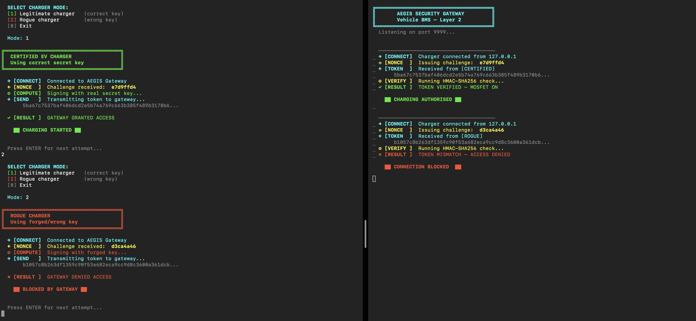
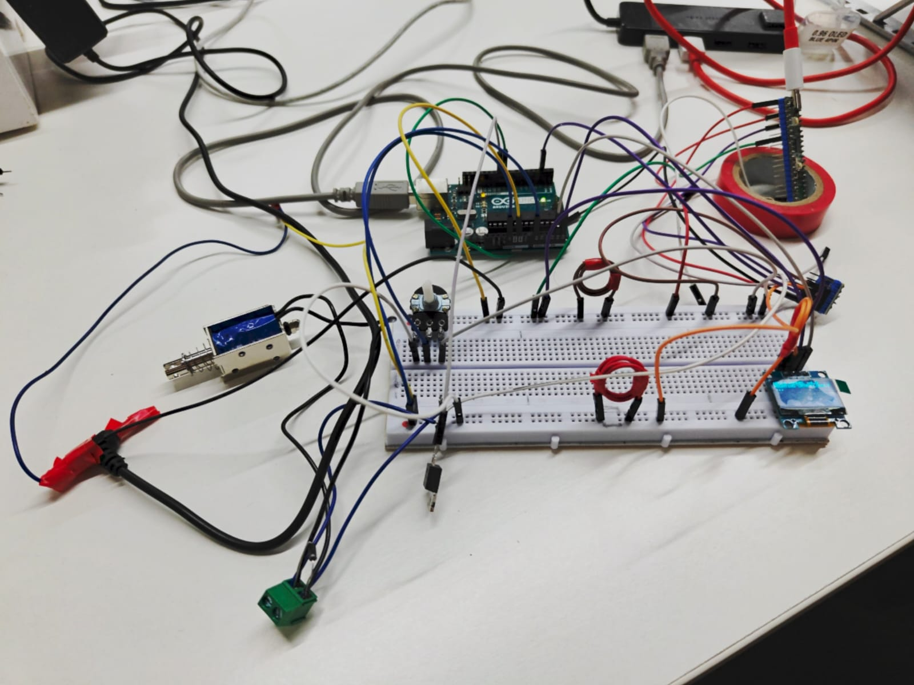
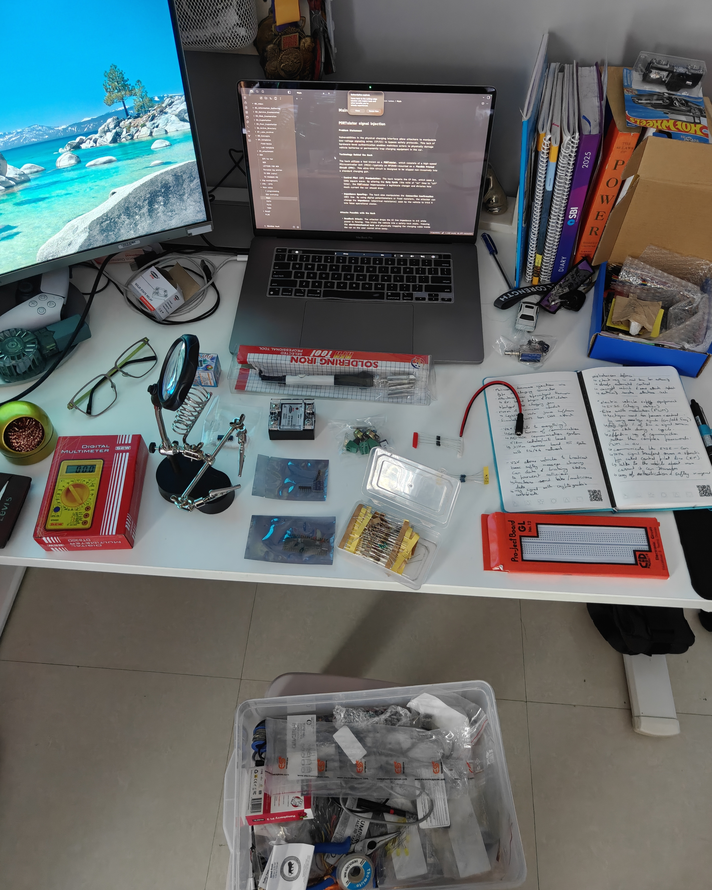

# ⚡ AEGIS — Dual-Layer EV Charging Security System
> **MAHE Mobility Challenge 2026 · Track B: Secure Plug & Charge Protocol**

[](https://github.com/23R0x7/Add_files_via_upload/commits/main)
[](https://standards.org)
[](https://standards.org)

**Juice Jacking** and **Identity Spoofing** are critical, often-overlooked vulnerabilities in public charging infrastructure. Aegis is a proactive, hardware-software intervention that secures the charging session via a strict, multi-layer verification pipeline. The gateway follows a strict "Fail-Fast" protocol, assuming every connection is malicious until proven otherwise.

---

## 🏗️ System Architecture
The AEGIS circuit connects two microcontrollers in a security pipeline that mirrors how a real EV charging session is initialized. The system enforces a professional **separation of concerns** between the Charger side (Execution) and the Vehicle side (Auditing).


### **Multi-Layer Defense Pipeline**
1.  **Layer 1: Physical Signal Audit:** The gateway performs high-speed digital analysis of the J1772 Control Pilot pulse frequency to instantly detect physical spoofing attacks (e.g., Juice Jacking).
2.  **Layer 2: Cryptographic Verification:** Once the physical layer is validated, the gateway performs a full **HMAC-SHA256 handshake** to prevent unauthorized charger impersonation (Identity Spoofing).

---

## 🛡️ Attack Scenarios Demonstrated

| Attack Method | Blocked By | Verification Level |
| :--- | :--- | :--- |
| **Juice Jacking** | Frequency analysis | Detected malicious 5kHz malformed signal (Standard is 1kHz). |
| **Signal Clone** | HMAC-SHA256 Handshake | Failed key verification due to dynamic nonce. |
| **Identity Spoofing** | XOR Challenge-Response | Mismatch of security seed. |
| **Replay Attack** | Dynamic Nonce Verification | Token from previous session is invalid. |

---

## 📡 Layer 1 Security Demonstration (Juice Jacking)
Attackers can send malformed pulses to impersonate a car. The Pico audits the pilot signal at the physical layer, with a $50\%$ duty cycle.

In safe mode, the signal is a strict 1kHz pulse. Any deviation outside the established safe window ($750\mu s - 1250\mu s$ period) immediately triggers a total hardware block.

---

## 🔐 Cryptographic Security Demonstration (Layer 2)
With Layer 1 verified, the gateway initiates the Layer 2 authentication. This prevents a "dumb" charger from just generating the right frequency. This part uses dynamic challenges (nonces) and a shared secret key (seed) to compute single-use tokens, preventing any form of replay attack.

This demonstrates the full verification process:
1.  Issuing Nonce
2.  Charger computing response
3.  Cross-verification on gateway

The XOR-based handshake uses this math:
> `Key = (Nonce XOR 0xAF) + 42`

This demo highlights the protocol's ability to prevent signal-cloning attacks.



---

## 🔌 Hardware Setup
The AEGIS gateway integrates logic level shifting, status telemetry, and actuator control into a cohesive prototype. The I2C display and Level Shifter work together with the MOSFET module to provide a physical power control gate.

* **The Circuit Schematic**:
    

* **Final Setup**:
    

* **Physical Components**:
    

This list summarizes the core components used in the build:
* **Microcontrollers:** Arduino Uno R3 (Charger), Raspberry Pi Pico W (Vehicle BMS)
* **I2C Status:** 0.96" SSD1306 OLED Display
* **Logic Bridging:** 4-Channel Logic Level Shifter
* **Human Interface:** 10k Potentiometer
* **Power Control:** IRF520 N-Channel MOSFET module
* **Actuator:** 12V DC Solenoid Valve

---

## 🧑‍💻 Repository Structure

```text
AEGIS/
├── demo/
│   ├── gateway.py             # Terminal demo - Gateway (BMS Auditor) side
│   └── charger.py             # Terminal demo - Charger side (Client simulation)
├── src/
│   ├── attacker/
│   │   └── attacker.ino       # Arduino Uno: PWM generation & OLED logic
│   └── gateway/
│       └── aegis_logic.py     # Pi Pico: High-speed PWM audit & decision logic
├── docs/
│   └── circuit_explanation.md # Deep-dive documentation of the physical layer
├── hardware/
│   └── parts_list.csv         # Bill of Materials and pin usage data
├── LICENSE                    # MIT License
├── media/
│   ├── circ_dia.png           # Professional circuit diagram
│   ├── sys_arch.png           # High-level architecture block diagram
│   ├── parts.jpg              # Component spread shot
│   ├── sec_key_demo.png       # Image of the Layer 2 authentication process
│   └── setup.jpeg             # Photo of the completed prototype
└── README.md                  # Project overview and security details
